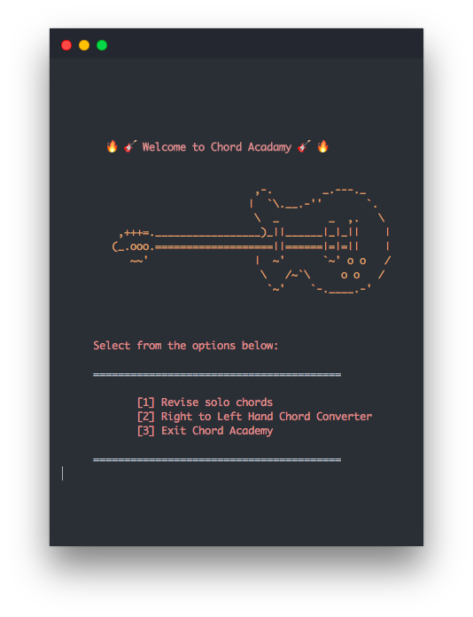
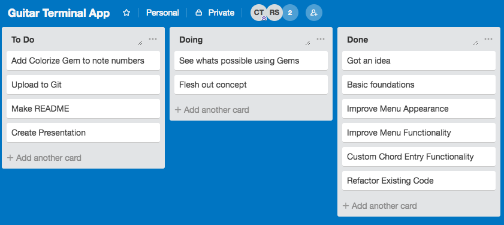

# Chord Academy

A guitar chord guide with an emphasis on catering to left-handed guitarists as well as right.

## The Problem

While there are a number of great options for finding out how to play guitar chords and songs online, often they're in many places and don't show how to play the chord on a left-handed guitar.

## The Solution

We created a terminal app that contains a selection of guitar chord diagrams in both right and left-hand format. For chord diagrams that we haven't included in the app, we have created a custom right to left-hand guitar chord converter.  
  
To do this, we also utilized tools such as Trello (screenshot below).  

  

## Built With

* [Rainbow](https://github.com/sickill/rainbow) - Ruby Gem for adding color to terminal output.

## Authors

* **Callum Thompson** (Righty)- [GitHub](https://github.com/calrt)
* **Ross Savill** (Lefty)- [GitHub](https://github.com/Ross-Savill)
