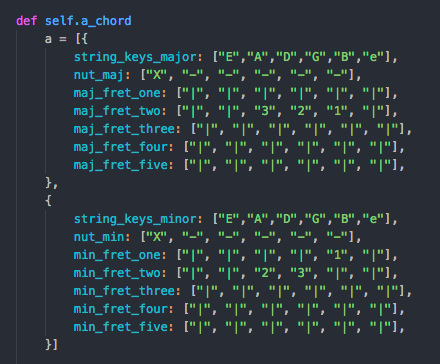
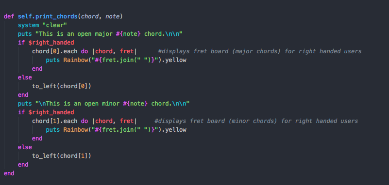
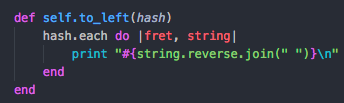

# Chord Academy

A guitar chord guide with an emphasis on catering to left-handed guitarists as well as right.

## The Problem

While there are a number of great options for finding out how to play guitar chords online, often they're in many places and don't show how to play the chord on a left-handed guitar.

## The Solution

We created a terminal app that contains a selection of guitar chord diagrams in both right and left-hand format. For chord diagrams that we haven't included in the app, we have created a custom right to left-hand guitar chord converter.  

## The Approach

We utilised code which was as reusable as possible to simplify the design and save time presenting each chord on screen. We also structured our app into three modules alongside our main page to break up the code into a format more simple to read and understand, with chords on one module, menus on another etc.

Each major and minor chord is saved in an array of two hashes, identified by the chord name:

The chords methods were arranged in order and structured around the other methods which should make the module easy to read for other programmers.
  
Storing the chords in this format allowed us to draw each chord when called using a single method, rather then assigning each chord a call and print method with unnecessary code:

A simple method called when a boolean indicates the user is left handed reverse the regular appaearance of the chords to suit a left-handed guitar player:

 

Our chord converter module collects the guitar player's custom chord and displays it back in a left handed format, using similar code from the chords module to display the data.

Throughout the process of creating this app we utilized tools such as Trello to help plan our process step by step.

  

## Built With

* [Rainbow](https://github.com/sickill/rainbow) - Ruby Gem for adding color to terminal output.

## Authors

* **Callum Thompson** (Righty)- [GitHub](https://github.com/calrt)
* **Ross Savill** (Lefty)- [GitHub](https://github.com/Ross-Savill)
